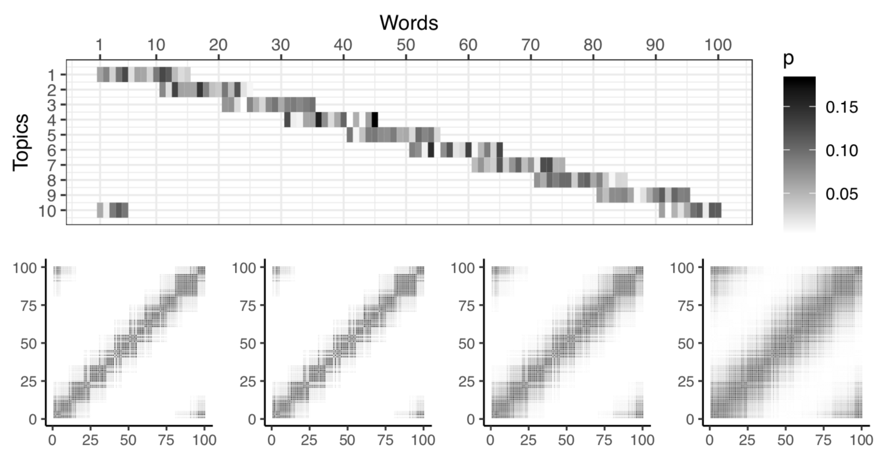

<!-- badges: start -->

<!-- badges: end -->

## Controlling the retrieval of general vs specific semantic knowledge in the instance theory of semantic memory.

Abstract: Distributional models of semantic cognition commonly make simplifying assumptions, such as representing word co- occurrence structure by prototype-like high-dimensional se- mantic vectors, and limit how retrieval processes may con- tribute to the construction and use of semantic knowl- edge. More recently, the instance theory of semantics (ITS, Jamieson, Avery, Johns, & Jones, 2018) reconceived a dis- tributional model in terms of instance-based memory, allow- ing context-specific construction of semantic knowledge at the time of retrieval. By simulation, we show that additional en- coding and retrieval operations, consistent with learning and memory theory, can play a crucial role in flexibly controlling the construction of general versus specific semantic knowl- edge. We argue this consolidation of processing principles holds insight for distributional theories of semantic cognition.

---

This is a [vertical](https://crumplab.github.io/vertical/) repository for:

Crump, M. J. C., Jamieson, R. K., Johns, B. T., and Jones, M. N. (2020) Controlling the retrieval of general vs specific semantic knowledge in the instance theory of semantic memory.  In S. Denison., M. Mack, Y. Xu, & B.C. Armstrong (Eds.), Proceedings of the 42nd Annual Conference of the Cognitive Science Society (pp. 3261-3267). Cognitive Science Society

This website contains links to the manuscript and supplementary files showing R code for the simulations. The source code for this website and project data is available in by clicking the github icon.

